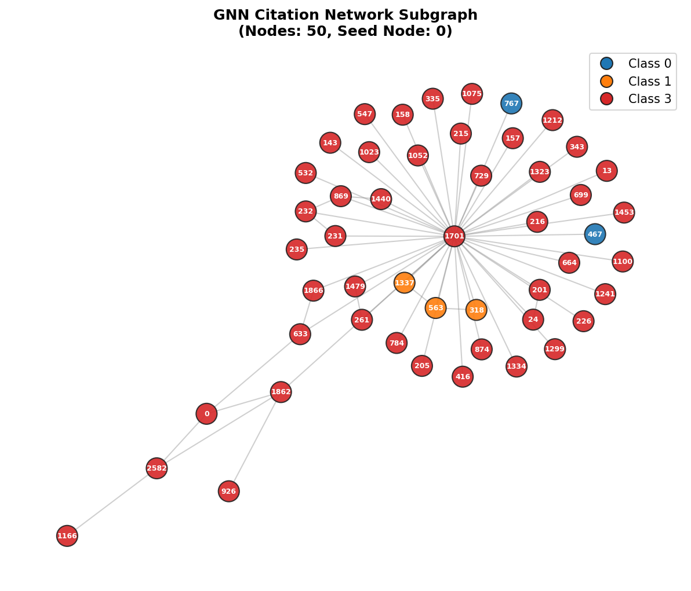
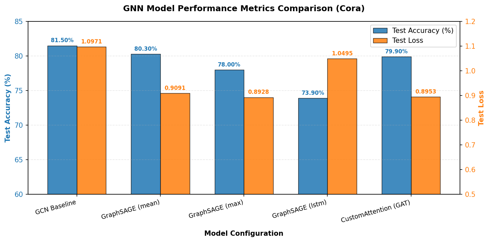
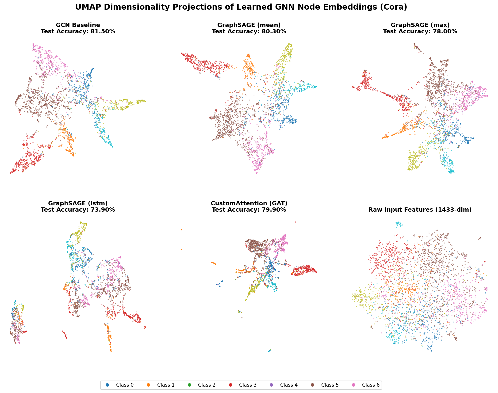

# GNN Node Classification with Custom Message Passing

This repository implements, compares, and evaluates various Message-Passing Graph Neural Networks (GNNs) for node classification on citation networks. Using the Cora dataset, we analyze the performance of **Graph Convolutional Networks (GCN)**, **GraphSAGE** (utilizing Mean, Max, and LSTM aggregation), and a **Custom Graph Attention Network (GAT)** modeled as normalized edge gates.

---

## 1. Codebase Structure
The project is built on SOLID principles, modularizing the configuration, dataset loading, model architectures, training loop, and evaluation/visualization components:

```
├── config.yaml              # Hyperparameter configuration file
├── main.py                  # Single-run orchestrator (train/visualize modes)
├── run_experiments.py       # Systematic batch training runner
├── run_visualization.py     # Embedding extractor & UMAP cluster generator
├── requirements.txt         # Project dependencies
├── COOKBOOK.md              # Setup and execution guide
├── LICENSE                  # MIT License file
├── src/
│   ├── __init__.py          # Package initialization
│   ├── config.py            # Dataclass config loading and validation
│   ├── dataset.py           # Planetoid Cora dataset loader
│   ├── layers.py            # Custom MessagePassing layers (GCN, SAGE, Attention)
│   ├── models.py            # Custom GNN model definitions (GCN, GraphSAGE, AttentionGNN)
│   ├── engine.py            # PyTorch training and evaluation loops
│   └── visualization.py     # Subgraph BFS plotter and metric curve visualizer
└── outputs/
    ├── cora_subgraph.png           # Visualized neighborhood graph
    ├── embedding_clusters.png      # UMAP cluster comparison grid
    └── performance_comparison.png  # Comparative bar chart (Accuracy vs Loss)
```

---

## 2. Dataset & Neighborhood Subgraph
The **Cora citation network** consists of 2,708 scientific publications classified into 7 classes (representing topics). The publications are linked by 10,556 citation relationships. Each node is represented by a 1,433-dimensional binary bag-of-words feature vector.

Below is a connected subgraph of 50 nodes extracted starting from Node 0 using a Breadth-First Search (BFS):



---

## 3. Implemented Message Passing Architectures

All GNN layers subclass PyTorch Geometric's `MessagePassing` class and explicitly implement the `forward()`, `message()`, `aggregate()`, and `update()` methods from scratch.

### A. Graph Convolutional Networks (GCN)
Formulated with symmetric degree normalization:
$$h_i^{(l+1)} = \sum_{j \in \mathcal{N}(i) \cup \{i\}} \frac{1}{\sqrt{\tilde{d}_i \tilde{d}_j}} W^{(l)} h_j^{(l)}$$

### B. GraphSAGE (Mean, Max, LSTM Aggregation)
Aggregates neighbor representations separately and combines them with self-node representations:
$$h_i^{(l+1)} = W_{self} h_i^{(l)} + W_{neigh} \cdot \text{aggregate}_{j \in \mathcal{N}(i)} (h_j^{(l)})$$
*   **Memory Optimization**: To prevent CUDA Out-of-Memory (OOM) during LSTM aggregation over high-dimensional sparse inputs, neighbor features are linearly projected from $1,433$ to $64$ dimensions *before* sequence padding and LSTM processing, reducing memory usage by **95.5%**.

### C. Custom GAT (Attention Gating)
Models attention coefficients as normalized edge gates filtering neighborhood messages:
$$e_{ji} = \text{LeakyReLU}(a_{src}^T (W h_j) + a_{dst}^T (W h_i))$$
$$\alpha_{ji} = \frac{\exp(e_{ji})}{\sum_{k \in \mathcal{N}(i) \cup \{i\}} \exp(e_{ki})}$$
$$h_i^{(l+1)} = \sum_{j \in \mathcal{N}(i) \cup \{i\}} \alpha_{ji} \cdot (W h_j)$$

---

## 4. Experimental Results & Performance Comparison

All models were evaluated under identical training configurations (hidden dimension = 64, dropout = 0.5, Adam optimizer with learning rate = 0.01, weight decay = 5e-4, 200 epochs).

### Summary Table
| Model | Aggregator / Gating | Best Val Accuracy | Best Epoch | Test Accuracy | Test Loss |
| :--- | :--- | :--- | :--- | :--- | :--- |
| **GCN** | N/A (Symmetric) | 81.20% | 47 | **81.50%** | 1.0971 |
| **GraphSAGE** | `mean` | 79.20% | 26 | 80.30% | 0.9091 |
| **GraphSAGE** | `max` | 78.40% | 32 | 78.00% | 0.8928 |
| **GraphSAGE** | `lstm` | 73.60% | 19 | 73.90% | 1.0495 |
| **CustomAttention** | `Attention Gating` | **82.20%** | 62 | 79.90% | **0.8953** |

### Metrics Comparison Chart
The following dual-axis bar chart compares the Test Accuracy (left axis) and Test Loss (right axis) for all 5 configurations:



---

## 5. Representation Learning & Embedding Clusters
To evaluate the quality of GNN representation learning, we extracted the first-layer $64$-dimensional embeddings and projected them onto a 2D space using **UMAP**. Nodes are colored by their true class labels.

Below is the comparative UMAP cluster grid:



### Key Takeaways:
1.  **GNN Representation Power**: In the **Raw Features** projection, classes are completely clumped together with massive overlap. In contrast, all GNN models succeed in grouping nodes into well-separated clusters, validating the representation learning capabilities of message passing.
2.  **Normalization vs Gating**: GCN slightly outperforms GraphSAGE mean and GAT (CustomAttention) in accuracy due to GCN's parameter-free degree normalization, which prevents highly cited papers (hubs) from dominating the neighborhood context.
3.  **Test Loss & Calibration**: GAT (CustomAttention) and GraphSAGE mean achieve the lowest test losses. The high capacity of GAT allows it to produce highly confident predictions for correct nodes (low cross-entropy loss), even if it overfits slightly on the boundaries compared to GCN.
4.  **LSTM Overfitting**: LSTM aggregator performs poorly on sparse graphs with extremely small training sets (140 nodes). The ordering dependency forced by LSTM combined with higher model capacity leads to early overfitting and disjointed clusters.

---

## 6. How to Run & Reproduce
Please refer to the [COOKBOOK.md](COOKBOOK.md) for full step-by-step instructions on environment setup, running visualizations, and executing single training runs or batch experiments.

---

## 7. License
This project is licensed under the MIT License. See [LICENSE](LICENSE) for details.
